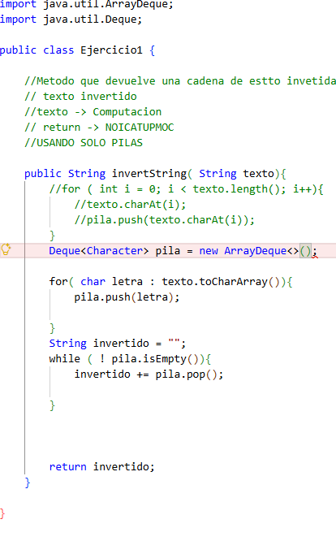
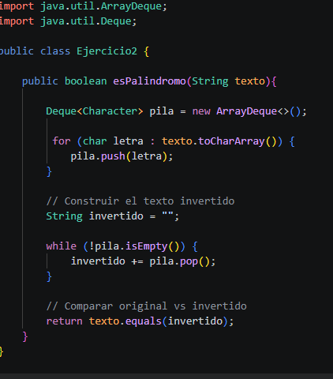
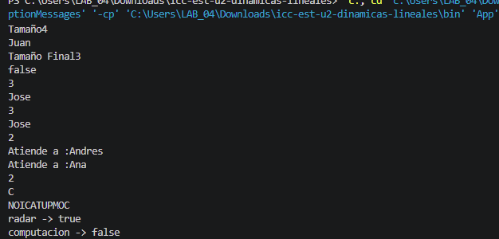

# Practica: Estructuras Dinamicas Lineales en java
## Datos del estudiante:
### Nombre: Andy Josue Uyaguari Espinoza
### Curso:Estructura de Datos Grupo1
### 7 de Junio, 2026
### Descripcion:

En esta seccion se implemeta las siguientes estructuras dinamicas lineales:
Listas enlazadas  con linkedList
pilas con Stack y Deque
colas con deque

Las dinámicas lineales son estructuras de datos en las que los elementos se organizan de manera secuencial, de modo que cada elemento tiene una relación directa con el siguiente. En este programa se utilizan tres estructuras lineales principales: LinkedList, Queue (cola) y Stack (pila).
 
 ##Captura de codigo: 
 

 ## 2. Ejercicio Palíndromo

**Fecha:** [10 de junio, 2026]

**Descripción:**
Se implementó un método para verificar si una cadena de texto es palíndroma utilizando una pila como estructura auxiliar. El algoritmo almacena cada carácter del texto en una pila y posteriormente los extrae para construir una versión invertida de la cadena. Finalmente, se compara el texto original con el texto invertido. Si ambos son iguales, el método retorna true; de lo contrario, retorna false.
.......

### Método implementado

## Salida de consola:

